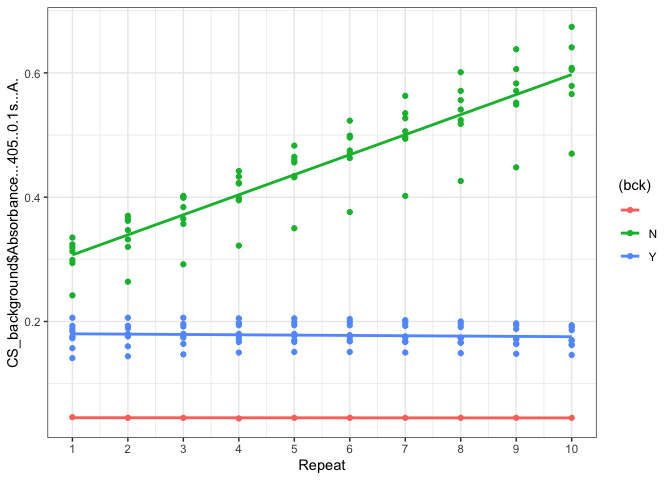
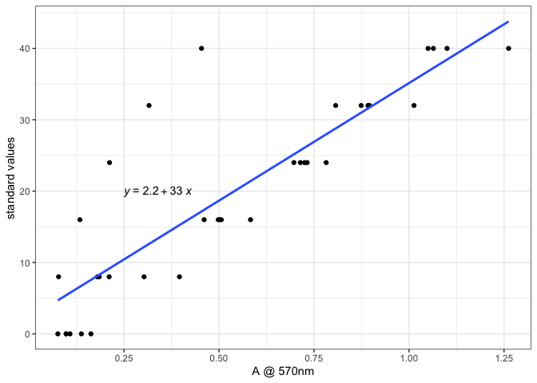
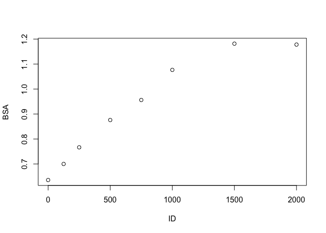
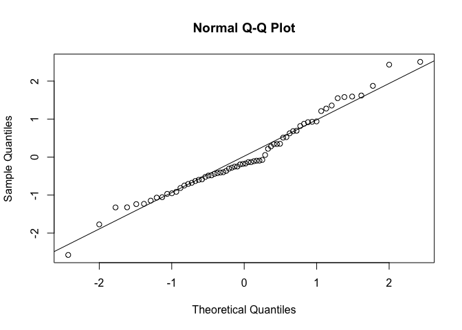
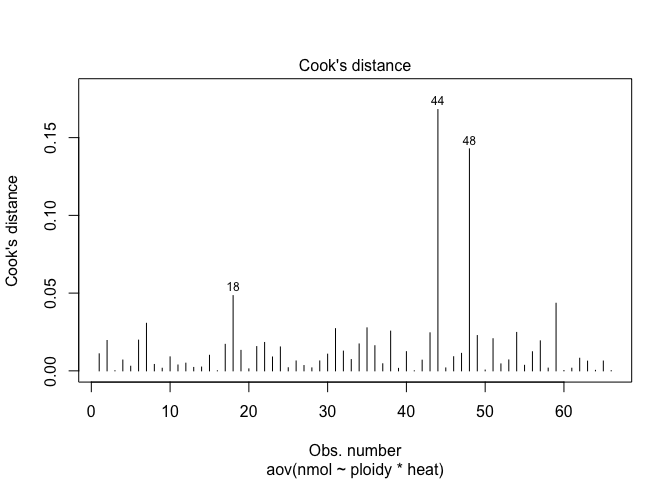
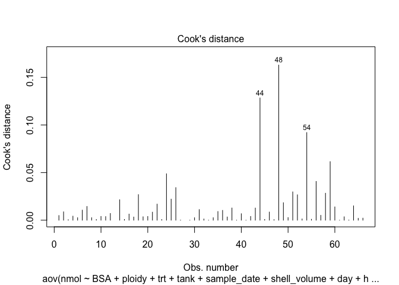
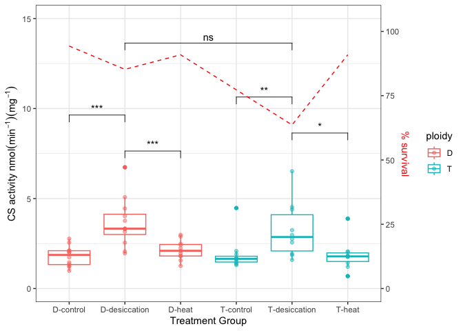
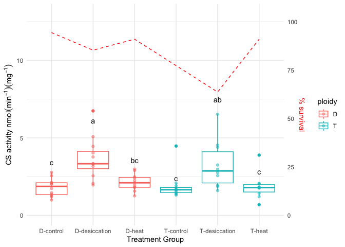
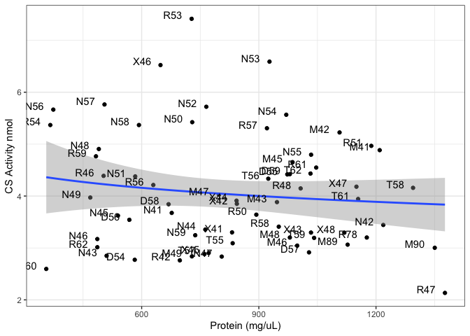

Coding Resources for paper named X authored by Olivia Cattau, Matt
George and Steven Roberts University of Washington School of Aquatic and
Fisheries Sciences Primary Contact: Olivia Catttau

For Calculating and Analysis of Citrate Synthase Enzyme Activity in
Pacific Oysters (C. gigas)

\#Load Libraries for the entire script

    library(ggplot2)

    ## Warning: package 'ggplot2' was built under R version 4.1.2

    library(dplyr)

    ## Warning: package 'dplyr' was built under R version 4.1.2

    ## 
    ## Attaching package: 'dplyr'

    ## The following objects are masked from 'package:stats':
    ## 
    ##     filter, lag

    ## The following objects are masked from 'package:base':
    ## 
    ##     intersect, setdiff, setequal, union

    library(ggpubr)
    library(knitr)

    ## Warning: package 'knitr' was built under R version 4.1.2

    library(lme4)

    ## Warning: package 'lme4' was built under R version 4.1.2

    ## Loading required package: Matrix

    ## Warning: package 'Matrix' was built under R version 4.1.2

    library(tidyverse)

    ## Warning: package 'tidyverse' was built under R version 4.1.2

    ## ── Attaching packages
    ## ───────────────────────────────────────
    ## tidyverse 1.3.2 ──

    ## ✔ tibble  3.1.8     ✔ purrr   0.3.5
    ## ✔ tidyr   1.2.1     ✔ stringr 1.4.1
    ## ✔ readr   2.1.3     ✔ forcats 0.5.2

    ## Warning: package 'tibble' was built under R version 4.1.2

    ## Warning: package 'tidyr' was built under R version 4.1.2

    ## Warning: package 'readr' was built under R version 4.1.2

    ## Warning: package 'purrr' was built under R version 4.1.2

    ## Warning: package 'stringr' was built under R version 4.1.2

    ## Warning: package 'forcats' was built under R version 4.1.2

    ## ── Conflicts ────────────────────────────────────────── tidyverse_conflicts() ──
    ## ✖ tidyr::expand() masks Matrix::expand()
    ## ✖ dplyr::filter() masks stats::filter()
    ## ✖ dplyr::lag()    masks stats::lag()
    ## ✖ tidyr::pack()   masks Matrix::pack()
    ## ✖ tidyr::unpack() masks Matrix::unpack()

    library(bestNormalize)

    ## Warning: package 'bestNormalize' was built under R version 4.1.2

    library(agricolae)
    library(multcompView)

\#Load Raw Citrate Synthase Absorbance data and Protein Data from
spectrophotometer

    CS_absorbance<-read.csv(file="https://raw.githubusercontent.com/ocattau/CS-manuscript/main/raw-data/Rawdata_Absorbance_CS.csv")
    BSA_absorbance<-read.csv(file="https://raw.githubusercontent.com/ocattau/CS-manuscript/main/raw-data/BSA_absorbance.csv")

\#Load morphometric data and labels for oyster numbers

    morph<-read.csv(file="https://raw.githubusercontent.com/mattgeorgephd/NOPP-gigas-ploidy-temp/main/202107_EXP2/citrate_synthase/Raw%20Data/morphometrics_CS.csv")

\#Look at Background Control for significance

    CS_background<-read.csv(file="https://raw.githubusercontent.com/mattgeorgephd/NOPP-gigas-ploidy-temp/main/202107_EXP2/citrate_synthase/Raw%20Data/CS_12_10_22_background.csv") 

    CS_BACKGROUND_ANOVA<-lm(CS_background$Absorbance...405..0.1s...A.~bck, data=CS_background)
    car::Anova(CS_BACKGROUND_ANOVA)  

    ## Anova Table (Type II tests)
    ## 
    ## Response: CS_background$Absorbance...405..0.1s...A.
    ##           Sum Sq  Df F value    Pr(>F)    
    ## bck       3.4488   2  355.03 < 2.2e-16 ***
    ## Residuals 0.7626 157                      
    ## ---
    ## Signif. codes:  0 '***' 0.001 '**' 0.01 '*' 0.05 '.' 0.1 ' ' 1

    background_plot<-ggplot(data=CS_background, aes(x=Repeat, y=CS_background$Absorbance...405..0.1s...A., color=(bck)))+geom_point()+theme_bw()+geom_smooth(method="lm", se=FALSE, formula=y~x)+scale_x_continuous(breaks=seq(1, 10, by=1)   ) 
    background_plot

    ## Warning: Use of `CS_background$Absorbance...405..0.1s...A.` is discouraged.
    ## ℹ Use `Absorbance...405..0.1s...A.` instead.
    ## Use of `CS_background$Absorbance...405..0.1s...A.` is discouraged.
    ## ℹ Use `Absorbance...405..0.1s...A.` instead.

background control is significantly different from the standard CS
values which means that I do not have to subtract the background from
the sample readings. Also you can see in ‘background plot’ that the
background readings did not increase while the CS readings did.

\#Look at plate effects before proceding

    anova1<-lm(delta.OD~plate*X1*X10*repeat., data=CS_absorbance)
    anova(anova1)

    ## Analysis of Variance Table
    ## 
    ## Response: delta.OD
    ##                       Df  Sum Sq Mean Sq    F value  Pr(>F)    
    ## plate                  1 0.16792 0.16792 7.7380e+05 < 2e-16 ***
    ## X1                     1 0.24866 0.24866 1.1459e+06 < 2e-16 ***
    ## X10                    1 1.46228 1.46228 6.7385e+06 < 2e-16 ***
    ## repeat.                1 0.00000 0.00000 8.7000e-03 0.92577    
    ## plate:X1               1 0.00000 0.00000 6.6680e-01 0.41464    
    ## plate:X10              1 0.00000 0.00000 2.6830e-01 0.60477    
    ## X1:X10                 1 0.00000 0.00000 3.3230e-01 0.56466    
    ## plate:repeat.          1 0.00000 0.00000 6.4130e-01 0.42372    
    ## X1:repeat.             1 0.00000 0.00000 4.5740e-01 0.49924    
    ## X10:repeat.            1 0.00000 0.00000 1.5256e+00 0.21749    
    ## plate:X1:X10           1 0.00000 0.00000 2.8394e+00 0.09275 .  
    ## plate:X1:repeat.       1 0.00000 0.00000 1.9600e-02 0.88865    
    ## plate:X10:repeat.      1 0.00000 0.00000 6.3000e-01 0.42782    
    ## X1:X10:repeat.         1 0.00000 0.00000 8.2800e-02 0.77365    
    ## plate:X1:X10:repeat.   1 0.00000 0.00000 1.9219e+00 0.16641    
    ## Residuals            404 0.00009 0.00000                       
    ## ---
    ## Signif. codes:  0 '***' 0.001 '**' 0.01 '*' 0.05 '.' 0.1 ' ' 1

    summary(anova1) #plate effects not significant

    ## 
    ## Call:
    ## lm(formula = delta.OD ~ plate * X1 * X10 * repeat., data = CS_absorbance)
    ## 
    ## Residuals:
    ##        Min         1Q     Median         3Q        Max 
    ## -1.163e-03 -7.047e-05 -2.682e-05  3.029e-05  1.072e-03 
    ## 
    ## Coefficients:
    ##                        Estimate Std. Error  t value Pr(>|t|)    
    ## (Intercept)          -0.0005721  0.0010343   -0.553   0.5805    
    ## plate                 0.0005177  0.0005329    0.971   0.3319    
    ## X1                   -0.9878681  0.0074546 -132.518   <2e-16 ***
    ## X10                   0.9930782  0.0059357  167.307   <2e-16 ***
    ## repeat.               0.0005021  0.0007598    0.661   0.5090    
    ## plate:X1             -0.0040811  0.0037962   -1.075   0.2830    
    ## plate:X10             0.0003381  0.0022781    0.148   0.8821    
    ## X1:X10               -0.0061335  0.0074181   -0.827   0.4088    
    ## plate:repeat.        -0.0003194  0.0002912   -1.097   0.2734    
    ## X1:repeat.           -0.0104784  0.0058275   -1.798   0.0729 .  
    ## X10:repeat.           0.0062535  0.0046125    1.356   0.1759    
    ## plate:X1:X10          0.0049909  0.0039935    1.250   0.2121    
    ## plate:X1:repeat.      0.0030095  0.0020917    1.439   0.1510    
    ## plate:X10:repeat.    -0.0006871  0.0013184   -0.521   0.6025    
    ## X1:X10:repeat.        0.0047070  0.0049979    0.942   0.3469    
    ## plate:X1:X10:repeat. -0.0029104  0.0020994   -1.386   0.1664    
    ## ---
    ## Signif. codes:  0 '***' 0.001 '**' 0.01 '*' 0.05 '.' 0.1 ' ' 1
    ## 
    ## Residual standard error: 0.0004658 on 404 degrees of freedom
    ## Multiple R-squared:      1,  Adjusted R-squared:      1 
    ## F-statistic: 5.772e+05 on 15 and 404 DF,  p-value: < 2.2e-16

no plate effects (p=0.3319), can use entire data set

\#View Controls plot CS standards to calculate standard curve equation

    CS_controls<-filter(CS_absorbance, ID == 0 | ID == 8 | ID == 16 | ID == 24 | ID == 32 |ID == 40) 

    CS_controls2<-(CS_absorbance[c(2:6),]) 

    #plot CS standards
    standard_plot<-ggplot(data=CS_controls,(aes(x=X1, y=as.numeric(ID))))+geom_point()+geom_smooth(method="lm", se=FALSE, formula = y ~ poly(x, 1) )+xlab("A @ 570nm")+ylab("standard values")+theme_bw()+stat_regline_equation(label.x=0.25, label.y=20)
    standard_plot

\#Extract Equation from standard curve *y* = 33*x* + 2.2

\#Calculate OD and CS values from standard curve *O**D* = *X*10 − *X*1
*x* = *O**D* so that *n**m**o**l**C**S* = 33 \* *O**D* + 2.2

    control_table<-CS_absorbance %>% 
      #filter(plate != 5) %>% #plate 5 had errors
      group_by(ID) %>% #group by oyster label (for combining replicates)
      summarise(avg1=mean(X1), avg2=mean(X10)) %>% #average OD
      filter(ID != 'R52') #outlier from anova analysis 

    CS_absorbance2<-mutate(control_table, OD = avg2-avg1)

    CS_absorbance3<-mutate(CS_absorbance2, nmol = 33*OD + 2.2) #nmol of CS enzyme

\#Calculate protein values from Bovine Serum Assay (BSA) to standardize
CS values

    protein_data<-BSA_absorbance %>%
      group_by(ID) %>%
      summarise(BSA = mean(A))

    bsa_standards<-filter(protein_data, ID == 0 | ID == 125 |ID == 250| ID == 500 | ID == 750 | ID == 1000| ID == 1500 | ID == 2000)
    plot(bsa_standards) #linear portion only from 0 to 1000

    bsa_standards<-(protein_data[c(1, 2, 3, 6, 7, 8),]) #select correct values [0:1000]

    bsa_standards$ID <- as.numeric(as.character(factor(bsa_standards$ID, levels=c("0", "125", "250", "500", "750", "1000"))))

    BSA_standard_curve<-ggplot(data=bsa_standards,(aes(x=BSA, y=(ID))))+geom_point()+geom_smooth(method="lm", se=FALSE, formula = y ~ x )+theme_bw()+stat_regline_equation(label.x=0.6, label.y=500)+ylab("ug/mL")

Equation from BSA protein curve produces *y* = 2300*x* − 1500 where
y=Protein in ug/mL and x=Absorbance from spectrophotometer from BSA
assay

\#Make final table with combined CS and BSA values
*n**m**o**l**C**S* = 33 \* *O**D* + 2.2

    protein_data$protein<-(2300*protein_data$BSA)-1500 #ug/mL

    protein_data$P<-(protein_data$protein)/1000/1000 #ug/ml-> ug/uL-> mg/uL  also equal to total protein extracted 

    t<-45 #min
    m<-33 #slope from CS standard curve
    b<-2.2 #intercept from CS standard curve
    V<-50 #uL from CS procedure 
    D<-1 #dilution coefficient, should be 1 since we did not dilute

    Full_dataset<-full_join(CS_absorbance3, protein_data, by='ID')

    Full_dataset<-Full_dataset[complete.cases(Full_dataset),] #remove NAs

    Full_dataset$CS_activity<-(Full_dataset$nmol/(t*V))*D/Full_dataset$P

\#Attach Morphometric Data Join the results (CS and BSA data) to
morphometric data gathered during the experiment, n=68

    treatments<-read.csv("https://raw.githubusercontent.com/mattgeorgephd/NOPP-gigas-ploidy-temp/main/202107_EXP2/citrate_synthase/Raw%20Data/treatments.csv")

    filter_my_data<-morph %>%
      filter(morph$ID %in% Full_dataset$ID)

    filter_my_data2<-filter_my_data[c(1,2,5,6,10,11,12,14,16,17)] #remove columns without data
    #keep: ploidy, trt, shell_length, shell_width, shell_height, mortality, shell volume, cal_dry_weight, ploidy.trt, tank

    Full_data<-full_join(filter_my_data2, treatments, by="ID")

    Full_data2<-full_join(Full_data, Full_dataset, by="ID")

    Full_data3<-Full_data2[complete.cases(Full_data2),] #remove NAs

    #add mortality data
    #mortality
    mortality<-read.csv("/Users/oliviacattau/Documents/GitHub/NOPP-gigas-ploidy-temp/202107_EXP2/citrate_synthase/Raw Data/survival_oc.csv")
    final_mort<-mortality$X..survival
    final_list<-mortality$trt
    mortality2<-data.frame(final_mort, final_list)

\#Statisical Analysis for verifying results in boxplot HSD and t-tests

    #is the data balanced
    balance<-ggplot(data=Full_data3)+geom_bar(aes(x=trt, color=ploidy))+ylim(0,15)+theme_minimal()
    # data is not balanced, used Multilevel models

    #does the data need transformation?
    test_me<-Full_data3$CS_activity
    norm_test <- shapiro.test(test_me) # p-value fail = good, don't need transformation
    if(norm_test$p.value<0.05)     {
            normalized <- bestNormalize(test_me)
            test_me <- normalized$x.t # overwrite
            qqnorm(test_me) # check linearity of transformed data
            qqline(test_me)
            print(shapiro.test(test_me))
            print("transformed!",quote=FALSE)}

    ## 
    ##  Shapiro-Wilk normality test
    ## 
    ## data:  test_me
    ## W = 0.97591, p-value = 0.2264
    ## 
    ## [1] transformed!

looks good, no need for transformation

\#Model Testing for Significance

    supp1<-read.csv(file="/Users/oliviacattau/Documents/GitHub/CS-manuscript/raw-data/supp1.csv")

    small_model<-aov(nmol~ploidy*heat, data=supp1) 
    summary(small_model)

    ##             Df Sum Sq Mean Sq F value Pr(>F)  
    ## ploidy       1   0.34   0.337   0.300 0.5857  
    ## heat         1   4.77   4.767   4.245 0.0436 *
    ## ploidy:heat  1   2.80   2.802   2.495 0.1193  
    ## Residuals   62  69.62   1.123                 
    ## ---
    ## Signif. codes:  0 '***' 0.001 '**' 0.01 '*' 0.05 '.' 0.1 ' ' 1
    ## 58 observations deleted due to missingness

    car::Anova(small_model, type=3) #use type 3 for interaction terms

    ## Anova Table (Type III tests)
    ## 
    ## Response: nmol
    ##              Sum Sq Df  F value  Pr(>F)    
    ## (Intercept) 145.001  1 129.1255 < 2e-16 ***
    ## ploidy        1.047  1   0.9328 0.33790    
    ## heat          7.485  1   6.6656 0.01221 *  
    ## ploidy:heat   2.802  1   2.4948 0.11931    
    ## Residuals    69.623 62                     
    ## ---
    ## Signif. codes:  0 '***' 0.001 '**' 0.01 '*' 0.05 '.' 0.1 ' ' 1

    plot(small_model, 4) #All data with Cook's distance > 0.5 will be removed

    #point 59 is an outlier, removed in line 81

    #test for significance accross morphometic data
    large_model<-aov(nmol~BSA+ploidy+trt+tank+sample_date+shell_volume+day+heat+calc_dry_weight, data=supp1)
    car::Anova(large_model, type=2)

    ## Note: model has aliased coefficients
    ##       sums of squares computed by model comparison

    ## Anova Table (Type II tests)
    ## 
    ## Response: nmol
    ##                 Sum Sq Df F value Pr(>F)
    ## BSA              0.515  1  0.5625 0.4564
    ## ploidy                  0               
    ## trt              0.362  1  0.3952 0.5322
    ## tank             0.071  1  0.0774 0.7819
    ## sample_date      0.029  1  0.0316 0.8596
    ## shell_volume            0               
    ## day                     0               
    ## heat                    0               
    ## calc_dry_weight         0               
    ## Residuals       51.256 56

    summary(large_model) #trt=treatments are the only variable that is significant

    ##              Df Sum Sq Mean Sq F value   Pr(>F)    
    ## BSA           1   1.36   1.365   1.491 0.227160    
    ## ploidy        1   0.19   0.185   0.202 0.654734    
    ## trt           4  24.01   6.003   6.559 0.000211 ***
    ## tank          1   0.11   0.107   0.117 0.733929    
    ## sample_date   1   0.02   0.020   0.022 0.881763    
    ## shell_volume  1   0.58   0.582   0.636 0.428470    
    ## Residuals    56  51.26   0.915                     
    ## ---
    ## Signif. codes:  0 '***' 0.001 '**' 0.01 '*' 0.05 '.' 0.1 ' ' 1
    ## 58 observations deleted due to missingness

    plot(large_model, 4) 

    ploidyANOVA<-lm(CS_activity~ploidy, data=Full_data3)
    car::Anova(ploidyANOVA, type=3)

    ## Anova Table (Type III tests)
    ## 
    ## Response: CS_activity
    ##              Sum Sq Df  F value Pr(>F)    
    ## (Intercept) 225.313  1 149.5165 <2e-16 ***
    ## ploidy        0.876  1   0.5812 0.4487    
    ## Residuals    96.444 64                    
    ## ---
    ## Signif. codes:  0 '***' 0.001 '**' 0.01 '*' 0.05 '.' 0.1 ' ' 1

    #CS activity is not significantly different between ploidy groups 

    #trt is significant, look at groups
    trtANOVA<-lm(CS_activity~trt, data=Full_data3)
    car::Anova(trtANOVA, type=3)

    ## Anova Table (Type III tests)
    ## 
    ## Response: CS_activity
    ##             Sum Sq Df F value    Pr(>F)    
    ## (Intercept) 38.716  1 38.2941 5.944e-08 ***
    ## trt         36.660  5  7.2521 2.280e-05 ***
    ## Residuals   60.660 60                      
    ## ---
    ## Signif. codes:  0 '***' 0.001 '**' 0.01 '*' 0.05 '.' 0.1 ' ' 1

    table1<-do.call(rbind.data.frame, (TukeyHSD(aov(trtANOVA))))
    table1 #significant codes for trt groups

    ##                                        diff         lwr         upr
    ## trt.D-desiccation-D-control      1.84849794  0.64010098  3.05689490
    ## trt.D-heat-D-control             0.34128750 -0.89426784  1.57684284
    ## trt.T-control-D-control          0.08593539 -1.14961995  1.32149073
    ## trt.T-desiccation-D-control      1.43818082  0.17080339  2.70555824
    ## trt.T-heat-D-control             0.04897428 -1.21840314  1.31635170
    ## trt.D-heat-D-desiccation        -1.50721044 -2.74276578 -0.27165510
    ## trt.T-control-D-desiccation     -1.76256254 -2.99811788 -0.52700720
    ## trt.T-desiccation-D-desiccation -0.41031712 -1.67769454  0.85706030
    ## trt.T-heat-D-desiccation        -1.79952366 -3.06690108 -0.53214623
    ## trt.T-control-D-heat            -0.25535210 -1.51748156  1.00677736
    ## trt.T-desiccation-D-heat         1.09689332 -0.19640453  2.39019117
    ## trt.T-heat-D-heat               -0.29231322 -1.58561106  1.00098463
    ## trt.T-desiccation-T-control      1.35224542  0.05894758  2.64554327
    ## trt.T-heat-T-control            -0.03696111 -1.33025896  1.25633673
    ## trt.T-heat-T-desiccation        -1.38920653 -2.71293908 -0.06547399
    ##                                        p adj
    ## trt.D-desiccation-D-control     0.0004352581
    ## trt.D-heat-D-control            0.9640136744
    ## trt.T-control-D-control         0.9999477707
    ## trt.T-desiccation-D-control     0.0172632784
    ## trt.T-heat-D-control            0.9999971866
    ## trt.D-heat-D-desiccation        0.0083259999
    ## trt.T-control-D-desiccation     0.0012159575
    ## trt.T-desiccation-D-desiccation 0.9306565339
    ## trt.T-heat-D-desiccation        0.0012974715
    ## trt.T-control-D-heat            0.9909568046
    ## trt.T-desiccation-D-heat        0.1414596087
    ## trt.T-heat-D-heat               0.9850459196
    ## trt.T-desiccation-T-control     0.0353717155
    ## trt.T-heat-T-control            0.9999993753
    ## trt.T-heat-T-desiccation        0.0343213345

    #multi-variant comparison
    tx<-with(Full_data3, interaction(trt, ploidy))
    amod<-aov(CS_activity ~ tx, data=Full_data3)
    mult_comp<-HSD.test(amod, "tx", group=TRUE, console=TRUE)

    ## 
    ## Study: amod ~ "tx"
    ## 
    ## HSD Test for CS_activity 
    ## 
    ## Mean Square Error:  1.011007 
    ## 
    ## tx,  means
    ## 
    ##                 CS_activity       std  r       Min      Max
    ## D-control.D        1.796191 0.5566877 12 0.9883003 2.769243
    ## D-desiccation.D    3.644689 1.3319918 12 1.9565283 6.736830
    ## D-heat.D           2.137479 0.5347404 11 1.2557215 2.985304
    ## T-control.T        1.882126 0.8887229 11 1.3085875 4.472556
    ## T-desiccation.T    3.234372 1.5206138 10 1.5935883 6.517331
    ## T-heat.T           1.845165 0.8277898 10 0.6890094 3.881666
    ## 
    ## Alpha: 0.05 ; DF Error: 60 
    ## Critical Value of Studentized Range: 4.163161 
    ## 
    ## Groups according to probability of means differences and alpha level( 0.05 )
    ## 
    ## Treatments with the same letter are not significantly different.
    ## 
    ##                 CS_activity groups
    ## D-desiccation.D    3.644689      a
    ## T-desiccation.T    3.234372     ab
    ## D-heat.D           2.137479     bc
    ## T-control.T        1.882126      c
    ## T-heat.T           1.845165      c
    ## D-control.D        1.796191      c

    mult_comp

    ## $statistics
    ##    MSerror Df     Mean       CV
    ##   1.011007 60 2.428812 41.39836
    ## 
    ## $parameters
    ##    test name.t ntr StudentizedRange alpha
    ##   Tukey     tx   6         4.163161  0.05
    ## 
    ## $means
    ##                 CS_activity       std  r       Min      Max      Q25      Q50
    ## D-control.D        1.796191 0.5566877 12 0.9883003 2.769243 1.331705 1.868804
    ## D-desiccation.D    3.644689 1.3319918 12 1.9565283 6.736830 3.006050 3.328069
    ## D-heat.D           2.137479 0.5347404 11 1.2557215 2.985304 1.809142 2.098394
    ## T-control.T        1.882126 0.8887229 11 1.3085875 4.472556 1.472834 1.649259
    ## T-desiccation.T    3.234372 1.5206138 10 1.5935883 6.517331 2.088549 2.863455
    ## T-heat.T           1.845165 0.8277898 10 0.6890094 3.881666 1.502812 1.787530
    ##                      Q75
    ## D-control.D     2.101511
    ## D-desiccation.D 4.129292
    ## D-heat.D        2.447332
    ## T-control.T     1.795981
    ## T-desiccation.T 4.099988
    ## T-heat.T        1.978653
    ## 
    ## $comparison
    ## NULL
    ## 
    ## $groups
    ##                 CS_activity groups
    ## D-desiccation.D    3.644689      a
    ## T-desiccation.T    3.234372     ab
    ## D-heat.D           2.137479     bc
    ## T-control.T        1.882126      c
    ## T-heat.T           1.845165      c
    ## D-control.D        1.796191      c
    ## 
    ## attr(,"class")
    ## [1] "group"

    mortality2$sig_groups<-c("c", "a", "bc", "c", "ab", "c")

    STATS = Full_data3 %>% group_by(trt) %>% 
      summarize(Q75 = quantile(CS_activity, probs = 0.75),
                Q25 = quantile(CS_activity, probs = 0.25),
                MaxVal = max(CS_activity), .groups = "keep") %>% 
      mutate(WhiskUp = 1.05* (Q75 + 1.5 * (Q75 - Q25)))
    pans2 = distinct(Full_data3, trt) %>%
      arrange(trt) %>% 
      inner_join(STATS, by = c("trt"))
    pans2$label = c("c", "a", "bc", "c", "ab", "c")

\#Data visualization

    ploidy_linear_plot<-ggplot(data=Full_data3,(aes(x=protein, y=CS_activity, color=ploidy)))+geom_point()+theme_bw()+geom_smooth(method="lm", se=FALSE, formula = y ~ x ) + ylab("CS Activity (nmol/(mg*min))") +xlab("Protein (ug/mL)")
    #ploidy does not determine CS activity

    boxplot<-ggplot(data=Full_data3, aes(x=factor(trt), y=CS_activity, color=ploidy))+
      geom_boxplot(aes(x=factor(trt), y=CS_activity, color=ploidy))+
      theme_bw()+geom_point(alpha=0.5)+
      ylab(expression('CS activity nmol' (min^-1) (mg^-1)))+
      xlab("Treatment Group")+ 
      stat_compare_means(comparisons=list(c("T-heat", "T-desiccation")), method = "wilcox.test", aes(label="..p.signif.."), label.y=8)+
      stat_compare_means(comparisons=list(c("D-heat", "D-desiccation")), method = "wilcox.test", aes(label="..p.signif.."), label.y=7)+
      stat_compare_means(comparisons=list(c("T-control", "T-desiccation")), method = "wilcox.test", aes(label="..p.signif.."), label.y=10)+
       stat_compare_means(comparisons=list(c("D-control", "D-desiccation")), method = "wilcox.test", aes(label="..p.signif.."), label.y=9)+
      stat_compare_means(comparisons=list(c("D-desiccation", "T-desiccation")), method = "wilcox.test", aes(label="..p.signif.."), label.y=13)+geom_line(data=mortality2, aes(x=final_list, y=final_mort/7, group=1),color="red", linetype="dashed")+scale_y_continuous(limits=c(0,15),
        # Add a second axis and specify its features
        sec.axis = sec_axis(~.*7, name="% survival")
      ) +theme(axis.title.y.right = element_text(color="red"))

    boxplot #with significance brakets

    boxplot2<-ggplot(data=Full_data3, aes(x=factor(trt), y=CS_activity, label=ploidy))+
      geom_boxplot(aes(x=factor(trt), y=CS_activity, color=ploidy))+
      theme_minimal()+geom_point(data=Full_data3, aes(color=ploidy), alpha=0.5)+
      ylab(expression('CS activity nmol' (min^-1) (mg^-1)))+
      xlab("Treatment Group") + geom_text(data = pans2, aes(y = WhiskUp, label = label ), position = position_dodge(width = .75))+scale_y_continuous(limits=c(0,13), sec.axis=sec_axis(~.*8, name="% survival"))+theme(axis.title.y.right=element_text(color="red"))+geom_line(data=mortality2, aes(x=final_list, y=final_mort/8, group=1),color="red", linetype="dashed", inherit.aes = FALSE) 

    boxplot2 #with letters for significance 

    protein_plot<-ggplot(data=Full_data3,(aes(x=protein, y=nmol, label=ID)))+geom_point()+theme_bw()+geom_smooth(method="lm", se=TRUE, formula = y ~ log(x) ) + ylab("CS Activity nmol") +xlab("Protein (mg/uL)")+geom_text(hjust=1.5, vjust=0)
    protein_plot #no correlation between protein and CS activity 

    ## Warning: The following aesthetics were dropped during statistical transformation: label
    ## ℹ This can happen when ggplot fails to infer the correct grouping structure in
    ##   the data.
    ## ℹ Did you forget to specify a `group` aesthetic or to convert a numerical
    ##   variable into a factor?

Based on the HSD (Honestly Significantly Different Test) Triploid
desiccation and Diploid desiccation groups are not significantly
different from each other but they are significantly different than both
control groups as well as Triploid heated group. Only the diploid
desiccation treatment was significantly different than all other groups
with the Triploid desiccation treatment not being different from the
Diploid heated group.

\#Are CS and Respiration (umol/L/hour) positively correlated?

    respirometry<-read.csv(file="https://raw.githubusercontent.com/mattgeorgephd/NOPP-gigas-ploidy-temp/main/202107_EXP2/respirometry/output/processed_summary_oyster.csv")

    resp_data<- respirometry %>%
      group_by(group_list) %>%
      summarise(avgRES = mean(umol_L_h))

    resp_data1<-Full_data3 %>%
      group_by(trt) %>%
      summarise(avgCS = mean(CS_activity))

    respdata<-cbind(resp_data, resp_data1, mortality2)

    resp_plot<-ggplot(data=respdata, aes(x=avgRES, y=avgCS))+geom_point(aes(color=group_list), size=5)+theme_minimal()+geom_smooth()+stat_regline_equation(label.x=25, label.y=2.0)

As a whole, respirometry is not positively correlated with CS. But if
you removed the Triploid heat only group it is positively correlated.
